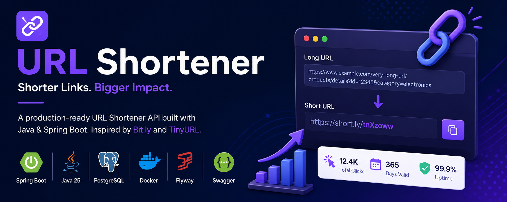

<p align="center">
  
</p>

# 🔗 URL Shortener

A production-ready URL Shortener built with Java & Spring Boot.

<div align="center">

### A Production-Ready URL Shortener built with Java & Spring Boot

Inspired by **Bit.ly** and **TinyURL**, this project demonstrates modern backend development practices using Spring Boot, PostgreSQL, Flyway, Docker, and Clean Architecture.


⭐ If you like this project, don't forget to star the repository.

</div>

---

# 📖 Overview

A URL Shortener converts long URLs into short, shareable links.

Instead of sharing a lengthy URL like:

```
https://www.example.com/products/electronics/mobile/samsung/galaxy-s26-ultra?color=black&storage=512GB
```

the application generates a compact URL such as:

```
http://localhost:8080/tnXzoww
```

When the short URL is accessed, the application redirects the user to the original URL using **HTTP 302 Found**.

This project is designed as a **production-ready backend application** that emphasizes clean architecture, maintainability, and industry best practices.

---

# ✨ Features

- 🔗 Generate Short URLs
- 🚀 Redirect to Original URL
- 📊 Track Click Count
- 📅 URL Expiration Support
- ✅ Active / Inactive URLs
- 🛡️ Global Exception Handling
- ✔️ Bean Validation
- 🗄️ Flyway Database Migrations
- 📖 Swagger / OpenAPI Documentation
- 🐳 Docker & Docker Compose Support
- ⚙️ Environment-based Configuration
- 🏗️ Clean Layered Architecture

---

# 🏛️ Architecture

```
                 Client
                    │
                    ▼
             REST Controller
                    │
                    ▼
              Service Layer
                    │
                    ▼
            Repository Layer
                    │
                    ▼
              PostgreSQL Database
```

The project follows a **Layered Architecture** with clear separation of responsibilities.

---

# 🛠️ Tech Stack

| Technology | Purpose |
|------------|----------|
| Java 25 | Programming Language |
| Spring Boot | Backend Framework |
| Spring Data JPA | ORM |
| PostgreSQL | Database |
| Flyway | Database Versioning |
| Docker | Containerization |
| Maven | Dependency Management |
| OpenAPI / Swagger | API Documentation |
| Lombok | Boilerplate Reduction |
| JUnit 5 | Unit Testing |
| Mockito | Mocking Framework |

---

# 📂 Project Structure

```
src
└── main
    ├── config
    ├── controller
    ├── dto
    │   ├── request
    │   └── response
    ├── entity
    ├── exception
    ├── mapper
    ├── repository
    ├── service
    ├── util
    └── validation
```

---

# ⚙️ Getting Started

## Clone Repository

```bash
git clone https://github.com/YOUR_USERNAME/url-shortener.git
```

```bash
cd url-shortener
```

---

## Environment Variables

Create a `.env` file in the project root.

```properties
DB_HOST=localhost
DB_PORT=5432
DB_NAME=url_shortener

DB_USERNAME=postgres
DB_PASSWORD=postgres

REDIS_HOST=localhost
REDIS_PORT=6379

SERVER_PORT=8080

SPRING_PROFILES_ACTIVE=dev
```

---

## Start Docker Containers

```bash
docker compose up -d
```

---

## Run the Application

```bash
./mvnw spring-boot:run
```

---

# 📖 API Documentation

Once the application starts,

Swagger UI

```
http://localhost:8080/swagger-ui
```

OpenAPI

```
http://localhost:8080/api-docs
```

---

# 🚀 REST APIs

## Create Short URL

```
POST /api/v1/urls
```

Example Request

```json
{
    "originalUrl": "https://www.google.com"
}
```

Example Response

```json
{
    "id": 1,
    "shortCode": "tnXzoww",
    "shortUrl": "http://localhost:8080/tnXzoww",
    "originalUrl": "https://www.google.com",
    "expiresAt": "2027-07-18T13:12:50Z"
}
```

---

## Redirect

```
GET /{shortCode}
```

Returns

```
HTTP 302 Found
```

---

# 🗄️ Database Schema

## short_urls

| Column | Description |
|---------|-------------|
| id | Primary Key |
| short_code | Unique Short Code |
| original_url | Original URL |
| click_count | Number of Redirects |
| active | Active Status |
| expires_at | Expiration Timestamp |
| created_at | Created Timestamp |
| updated_at | Updated Timestamp |

---

# 🧩 Engineering Practices

This project follows modern backend engineering practices:

- SOLID Principles
- Clean Layered Architecture
- DTO Pattern
- Repository Pattern
- Builder Pattern
- Constructor Injection
- Global Exception Handling
- Bean Validation
- Flyway Database Migrations
- Environment-based Configuration
- Dockerized Development

---

# 📈 Future Improvements

Future versions may include:

- Redis Caching
- Unit Testing
- Integration Testing
- Spring Security + JWT
- User Authentication
- Analytics Dashboard
- QR Code Generation
- Custom Short URLs
- Rate Limiting

---

# 🎯 Learning Outcomes

This project demonstrates experience with:

- Java Backend Development
- Spring Boot
- REST API Design
- PostgreSQL
- Flyway
- Docker
- Exception Handling
- Maven
- OpenAPI / Swagger
- Layered Architecture
- Production-Oriented Development

---

# 👨‍💻 Author

**Gaurav**

Backend Developer | Java | Spring Boot

If you found this project helpful, consider giving it a ⭐ on GitHub.

---